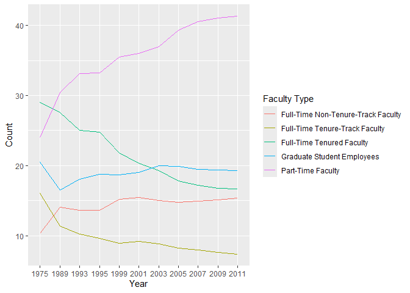
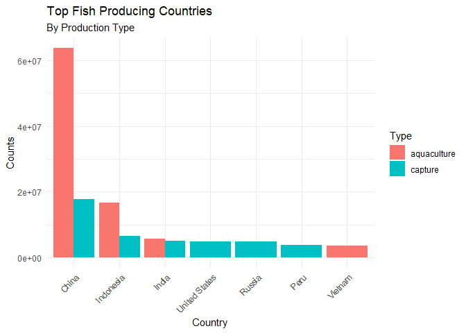
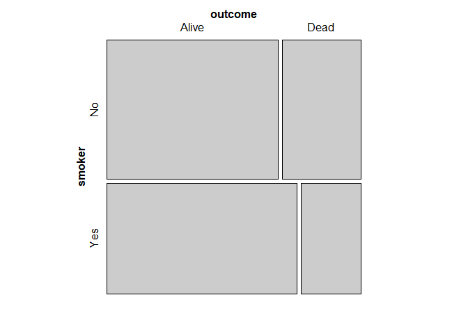
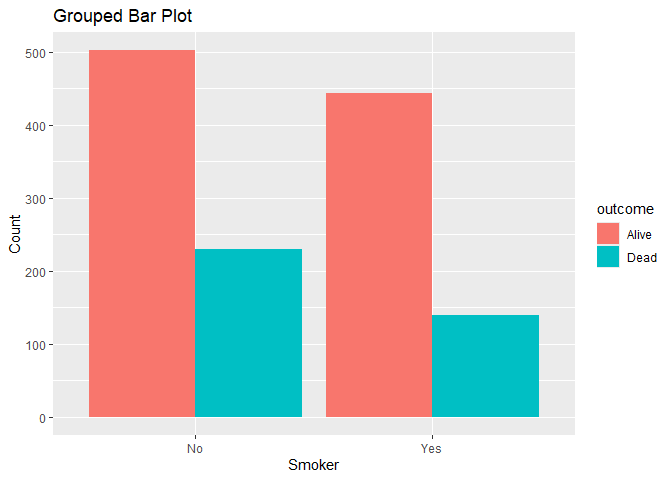
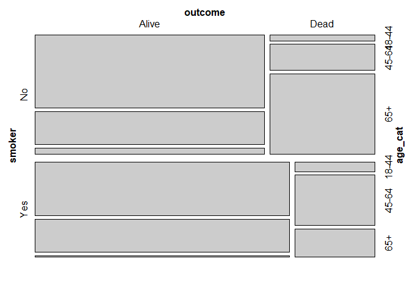
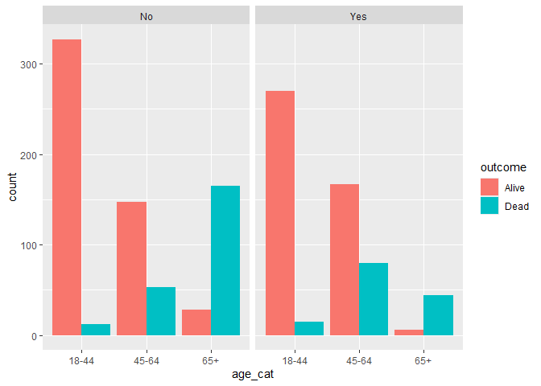

Lab 06 - Ugly charts and Simpson’s paradox
================
Hannah Crawley
2.17.25

### Load packages and data

``` r
library(tidyverse) 
library(dsbox)
library(mosaicData) 
```

### Exercise 1

``` r
staff <- read_csv("data/instructional-staff.csv")
```

    ## Rows: 5 Columns: 12
    ## ── Column specification ────────────────────────────────────────────────────────
    ## Delimiter: ","
    ## chr  (1): faculty_type
    ## dbl (11): 1975, 1989, 1993, 1995, 1999, 2001, 2003, 2005, 2007, 2009, 2011
    ## 
    ## ℹ Use `spec()` to retrieve the full column specification for this data.
    ## ℹ Specify the column types or set `show_col_types = FALSE` to quiet this message.

``` r
staff_long <- staff %>%
  pivot_longer(cols = -faculty_type, names_to = "year") %>%
  mutate(value = as.numeric(value))
```

``` r
staff_long
```

    ## # A tibble: 55 × 3
    ##    faculty_type              year  value
    ##    <chr>                     <chr> <dbl>
    ##  1 Full-Time Tenured Faculty 1975   29  
    ##  2 Full-Time Tenured Faculty 1989   27.6
    ##  3 Full-Time Tenured Faculty 1993   25  
    ##  4 Full-Time Tenured Faculty 1995   24.8
    ##  5 Full-Time Tenured Faculty 1999   21.8
    ##  6 Full-Time Tenured Faculty 2001   20.3
    ##  7 Full-Time Tenured Faculty 2003   19.3
    ##  8 Full-Time Tenured Faculty 2005   17.8
    ##  9 Full-Time Tenured Faculty 2007   17.2
    ## 10 Full-Time Tenured Faculty 2009   16.8
    ## # ℹ 45 more rows

``` r
staff_long %>%
  ggplot(aes(x = year, y = value, group = faculty_type, color = faculty_type)) +
  geom_line() + 
  labs(Title = "Faculty Type by Year", y = "Count", x = "Year", color = "Faculty Type")
```

<!-- -->

> Include the line plot you made above in your report and make sure the
> figure width is large enough to make it legible. Also fix the title,
> axis labels, and legend label.

### Exercise 2

> Suppose the objective of this plot was to show that the proportion of
> part-time faculty have gone up over time compared to other
> instructional staff types. What changes would you propose making to
> this plot to tell this story?

- Can filter for part-time faculty then alter the plot so that the
  y-axis reflects change in percentage of faculty over time and the
  x-axis reflects year

### Exercise 3

> Can you help them make improve it? First, brainstorm how you would
> improve it. Then create the improved visualization and document your
> changes/decisions with bullet points. It’s ok if some of your
> improvements are aspirational, i.e. you don’t know how to implement
> it, but you think it’s a good idea. Implement what you can and leave
> notes identifying the aspirational improvements that could not be
> made. (You don’t need to recreate their plots in order to improve
> them)

Potential Improvements:  
- perhaps a bar graph would help to better visualize the smoothed line
graph - adjusting the scale of the graph so that you can see the
countries that have lower fishery production - pie plots are not
extremely informative, especially those with a hole in the middle
(cannot see the angles which is how one determines sizes of categories)

``` r
fisheries <- read_csv("data/fisheries.csv")
```

    ## Rows: 216 Columns: 4
    ## ── Column specification ────────────────────────────────────────────────────────
    ## Delimiter: ","
    ## chr (1): country
    ## dbl (3): capture, aquaculture, total
    ## 
    ## ℹ Use `spec()` to retrieve the full column specification for this data.
    ## ℹ Specify the column types or set `show_col_types = FALSE` to quiet this message.

``` r
fisheries
```

    ## # A tibble: 216 × 4
    ##    country             capture aquaculture  total
    ##    <chr>                 <dbl>       <dbl>  <dbl>
    ##  1 Afghanistan            1000        1200   2200
    ##  2 Albania                7886         950   8836
    ##  3 Algeria               95000        1361  96361
    ##  4 American Samoa         3047          20   3067
    ##  5 Andorra                   0           0      0
    ##  6 Angola               486490         655 487145
    ##  7 Antigua and Barbuda    3000          10   3010
    ##  8 Argentina            755226        3673 758899
    ##  9 Armenia                3758       16381  20139
    ## 10 Aruba                   142           0    142
    ## # ℹ 206 more rows

``` r
fishlong <- fisheries %>%
  pivot_longer(cols = c(aquaculture,capture, total), 
               names_to = "Type",
               values_to = "Counts")
```

``` r
fishlong
```

    ## # A tibble: 648 × 3
    ##    country        Type        Counts
    ##    <chr>          <chr>        <dbl>
    ##  1 Afghanistan    aquaculture   1200
    ##  2 Afghanistan    capture       1000
    ##  3 Afghanistan    total         2200
    ##  4 Albania        aquaculture    950
    ##  5 Albania        capture       7886
    ##  6 Albania        total         8836
    ##  7 Algeria        aquaculture   1361
    ##  8 Algeria        capture      95000
    ##  9 Algeria        total        96361
    ## 10 American Samoa aquaculture     20
    ## # ℹ 638 more rows

``` r
top20 <- fishlong %>% 
  arrange(desc(Counts)) %>%  
  top_n(20, Counts)
```

``` r
top20 %>% 
  filter(Type != "total") %>% 
  ggplot(aes(x = reorder(country, -Counts), y = Counts, fill = Type)) +
  geom_bar(stat = "identity", position = "dodge") +  
  labs(title = "Top Fish Producing Countries", subtitle = "By Production Type", x = "Country", y = "Counts") +
  theme_minimal() +
  theme(axis.text.x = element_text(angle = 45, hjust = 1)) 
```

<!-- -->

- this gives a graph of the top fish producing countries by production
  type

## Stretch Practice with Smokers in Whickham

``` r
library(tidyverse)
library(mosaicData)
```

``` r
data("Whickham")
```

``` r
?Whickham
```

    ## starting httpd help server ... done

``` r
library(performance)
```

### Exercise 1

> What type of study do you think these data come from: observational or
> experiment? Why?

- Observational - since no variable is being manipulated

### Exercise 2

> How many observations are in this dataset? What does each observation
> represent?

- 1314 observations on women who wree classified as current smokers or
  have never smoked

### Exercise 3

> How many variables are in this dataset? What type of variable is each?
> Display each variable using an appropriate visualization.

3 variables - outcome (survival status after 20 years - levels
alive/dead), smoker (baseline - levels yes/no), age (at time of first
survey)

All variables are factors

``` r
Whickham %>%  
  count(outcome)
```

    ##   outcome   n
    ## 1   Alive 945
    ## 2    Dead 369

``` r
Whickham %>%  
  count(smoker)
```

    ##   smoker   n
    ## 1     No 732
    ## 2    Yes 582

``` r
summary(Whickham$age)
```

    ##    Min. 1st Qu.  Median    Mean 3rd Qu.    Max. 
    ##   18.00   32.00   46.00   46.92   61.00   84.00

### Exercise 4

> What would you expect the relationship between smoking status and
> health outcome to be?

- I would expect the relationship to be negative (positive smoking
  status and poor health outcome)

### Exercise 5

> Create a visualization depicting the relationship between smoking
> status and health outcome. Briefly describe the relationship, and
> evaluate whether this meets your expectations. Additionally, calculate
> the relevant conditional probabilities to help your narrative. Here is
> some code to get you started:

``` r
Whickham %>%
  count(smoker, outcome)
```

    ##   smoker outcome   n
    ## 1     No   Alive 502
    ## 2     No    Dead 230
    ## 3    Yes   Alive 443
    ## 4    Yes    Dead 139

``` r
library(vcd)
```

    ## Loading required package: grid

``` r
mosaic(~ smoker + outcome, data = Whickham)
```

<!-- -->

``` r
Whickham %>% 
  ggplot(aes(x = smoker, fill = outcome)) +
  geom_bar(position = "dodge") +
  labs(title = "Grouped Bar Plot", x = "Smoker", y = "Count") 
```

<!-- -->

- There appears to be a greater proportion of those who are smokers to
  be alive than dead, the opposite of what was anticipated

### Exercise 6

``` r
Whickham_cat <- Whickham %>%  
  mutate(age_cat = case_when(
    age <= 44 ~ "18-44", 
    age > 44 & age <= 64 ~ "45-64",
    age > 64 ~ "65+"
    ))
```

### Exercise 7

> Re-create the visualization depicting the relationship between smoking
> status and health outcome, faceted by age_cat. What changed? What
> might explain this change? Extend the contingency table from earlier
> by breaking it down by age category and use it to help your narrative.
> We can use the contingency table to examine how the relationship
> between smoking status and health outcome differs between different
> age groups. This extension will help us better understand the patterns
> we see in the visualization, and explain any changes we observe.

``` r
Whickham_cat %>%
  count(smoker, age_cat, outcome) 
```

    ##    smoker age_cat outcome   n
    ## 1      No   18-44   Alive 327
    ## 2      No   18-44    Dead  12
    ## 3      No   45-64   Alive 147
    ## 4      No   45-64    Dead  53
    ## 5      No     65+   Alive  28
    ## 6      No     65+    Dead 165
    ## 7     Yes   18-44   Alive 270
    ## 8     Yes   18-44    Dead  15
    ## 9     Yes   45-64   Alive 167
    ## 10    Yes   45-64    Dead  80
    ## 11    Yes     65+   Alive   6
    ## 12    Yes     65+    Dead  44

``` r
library(vcd)
mosaic(~ smoker + outcome + age_cat, data = Whickham_cat)
```

<!-- -->

``` r
Whickham_cat %>% 
  ggplot(aes(x = age_cat, fill = outcome)) +
  geom_bar(position = "dodge") +
  facet_wrap(~ smoker)
```

<!-- -->

``` r
  labs(title = "Outcome by Age Category and Smoker Staus", x = "Age Category", y = "Count", fill = "Outcome") 
```

    ## $x
    ## [1] "Age Category"
    ## 
    ## $y
    ## [1] "Count"
    ## 
    ## $fill
    ## [1] "Outcome"
    ## 
    ## $title
    ## [1] "Outcome by Age Category and Smoker Staus"
    ## 
    ## attr(,"class")
    ## [1] "labels"

- there are greater number of alive and fewer dead in the youngest age
  group in the non-smokers

- interestingly there is a greater number of alive in the smoker but
  also more dead in the middle age group

- there are fewer alive in the oldest age group of smokers than
  non-smokers but more dead in the non-smokers than smokers

- looking at the mosaic it looks like there is a greater proportion of
  dead non-smokers than there are smokers in all 3 age groups
